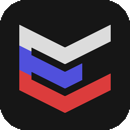

# Русификатор для сборки MI:Foundation.

### Обратите внимание:

_Русификатор находится на стадии разработки. Что-то может быть не переведено или переведено некорректно._

Но вы можете с этим помочь!

## Скачивание

Загрузите [желаемую версию][version] русификатора.

## Требования

Клиент `MI:Foundation` в лаунчере [Enthusiasm][site].

## Установка

Перенесите скачанный архив в папку игры. 

По умолчанию это: `C:\Users\%UserName%\AppData\Roaming\Enthusiasm\updates\MIF\resourcepacks`

Потом просто включите ресурспак в игре:

## Создано сообществом

Полная история обновлений и авторов доступна на [Github][history], здесь же приведены те, кто внёс основной вклад: 
- **EnEtoRiator** - его перевод взят за основу, спасибо ему.
- **eterna1_0blivion** - он создал репозиторий и дал (впихнул) возможность сообществу переводить игру.
- ...а это место специально для вас. Присоединяйтесь!

## Ветки Git

- `main` - основная ветка с проверенным (относительно) переводом
- `dev` - разные экспериментальные приколы, скачивать на свой страх и риск.

[version]: https://github.com/eterna1-0blivion/enthusiasm-translation/releases/ "Все релизы"
[history]: https://github.com/eterna1-0blivion/enthusiasm-translation/commits/main "История проекта"
[site]: https://enthusiasm.pro/about "Сайт игры"